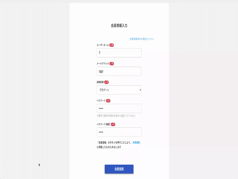
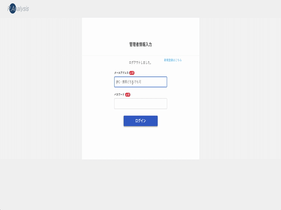
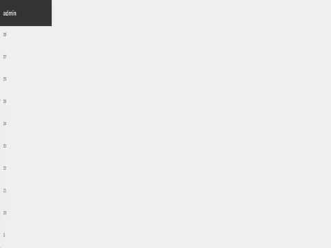

# アプリ名
Programing Analisys

# 概要
プログラミングを始めたい人が、自分に合った最適な学習法を見つけることができるアプリです。

- 学習法診断  
3つの質問に答えることで自分に最適なプログラミング学習法を見つけることができます  
- 学習法相談  
エンジニアにチャットで学習法の相談ができます
- クーポン送付  
相談したユーザーにクーポン付きメールを自動送信します

# 本番環境
現在準備中

# 制作背景(意図)
このアプリを制作した意図は「プログラミングを始めたいけど始められない人の背中を押したい」と思ったからです。

プログラミングを始められない理由は2点あるのではないかと考えました。  
①プログラミング学習に関する情報が増えてユーザーが選べなくなっている  
②選んだ学習法に自信が持てない

特に、②は身近にエンジニアがいなくて相談できないため、結局最後の一歩が踏み出せないのではないかと考えました。そのため、エンジニアに相談して不安を取り除き、学習を始める勇気付けができたら嬉しいと思い、このアプリを作成しました。

# DEMO
- 学習法の診断〜診断結果表示  
  
- ユーザー登録〜チャット〜クーポン送信  
  
- 管理書ログイン〜登録内容の確認  
  
- 管理者ユーザーのチャット  
  
					
# 工夫したポイント
## ユーザーの使いやすさ
- 学習法診断は多くのユーザーに使ってもらいたいので、ログインせずに使用可能
- 質問を選択するたびに内容が入れ替わるようにして回答のストレスを低減
- チャットは非同期通信にすることでストレスを低減

## 画像の選択
- トップ画像はプログラミングを学んだ後のイメージを再現
- 質問画面では落ち着いて選べるように、人がいない、プログラミングと向き合える画像を選択
- 相談画面では安心して相談できるように女性のイメージを選択

## 運営側のの体制整備
- 入力データの管理、管理者ユーザーの管理、チャットルームへの移行体制を整備
- 管理者ユーザーはすべてのチャットルームにアクセスできるように設定

# 使用技術(開発環境)  
Ruby on rails  

# 課題や今後実装したい機能  
- 未読メッセージのあるroomの表示機能  
管理者がユーザーからのメッセージに即時対応できるようにするためです。

- アプリに対する「いいね」機能  
たくさんの「いいね」があればユーザーが安心してアプリを使えるようになるからです。

- 質問の進捗表示  
仮に質問が多くなった場合、あと何問で終わるかがわからないとストレスになるからです。

# DB設計						
## users テーブル

| Column             | Type    | Options                  |
| ------------------ | ------- | ------------------------ |
| username           | string  | null: false              |
| email              | string  | null: false              |
| passwordencrypted_ | string  | null: false              |
| result_id          | integer | null: false, active hash |

### Association

- has_one :rooms
- has_many :messages

## admins テーブル

| Column             | Type    | Options                  |
| ------------------ | ------- | ------------------------ |
| name               | string  | null: false              |
| email              | string  | null: false              |
| passwordencrypted_ | string  | null: false              |

### Association

- has_many :room_admins
- has_many :rooms, through: :room_admins
- has_many :messages

## rooms テーブル

| Column | Type       | Options                        |
| ------ | ---------- | ------------------------------ |
| user   | references | null: false, foreign_key: true |

### Association

- has_many :room_admins
- has_many :admins, through: :room_admins
- belongs_to :users
- has_many :messages

## room_admins テーブル

| Column | Type       | Options                        |
| ------ | ---------- | ------------------------------ |
| admin  | references | null: false, foreign_key: true |
| room   | references | null: false, foreign_key: true |

### Association

- belongs_to :room
- belongs_to :admin

## messages テーブル

| Column  | Type       | Options                        |
| ------- | ---------- | ------------------------------ |
| message | text       | null: false                    |
| admin   | references | foreign_key: true              |
| user    | references | foreign_key: true              |
| room    | references | null: false, foreign_key: true |

### Association

- belongs_to :room
- belongs_to :admin
- belongs_to :user

## studies テーブル

| Column  | Type   | Options     |
| ------- | ------ | ----------- |
| method  | string | null: false |
| content | text   | null: false |
| reason  | text   | null: false |
| price   | string | null: false |
| url     | text   | null: false |
